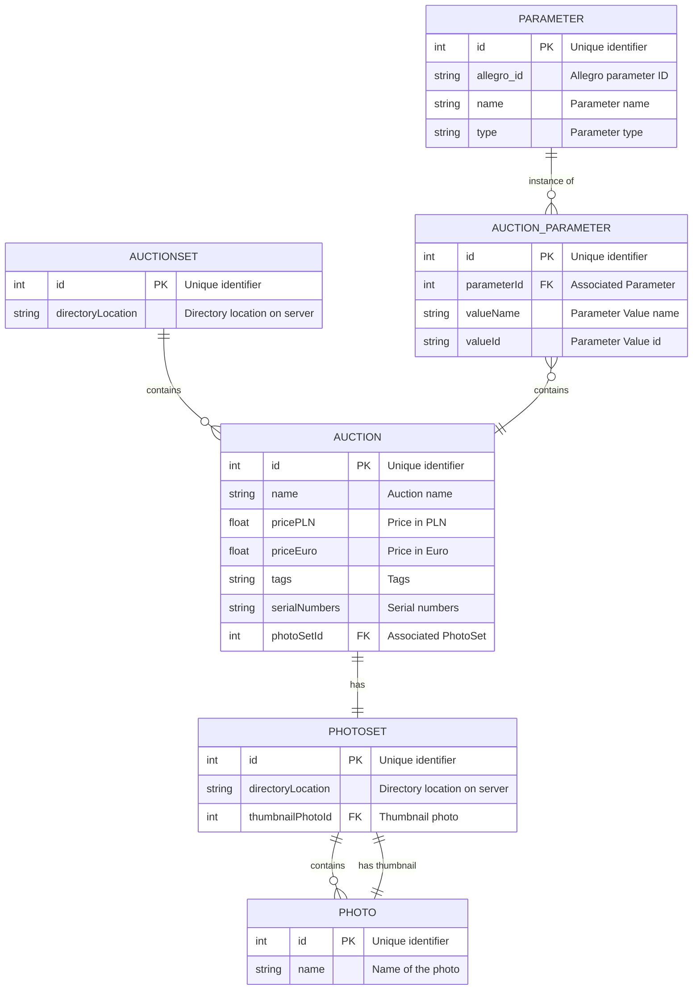

# Sell That Sheet API

---

## Running Celery tasks

Celery uses Redis as the message broker. The Python client library is not
installed by default when using the source code directly. Install it before
running any Celery tasks:

```bash
pip install redis
```

The provided Dockerfile already installs this dependency.


 
